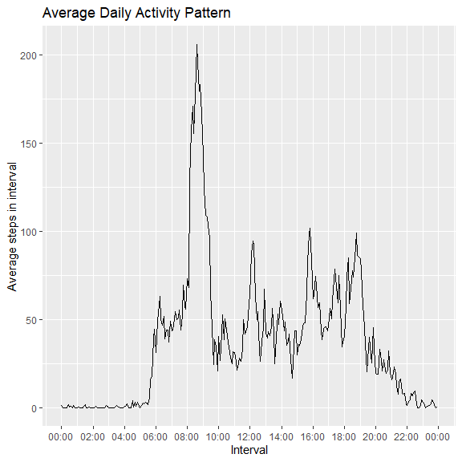

## Loading and preprocessing the data


```r
unzip('activity.zip', exdir = ".", unzip = "internal")
acdata <- read.csv('activity.csv',header = T,sep = ',',quote = '"',na.strings = 'NA')
acdata <- transform(acdata,date=as.Date.character(date,format = '%Y-%m-%d'))
interval_to_date <- function(x){
    time = str_pad(x,4,pad = '0')
    dt = strptime(x = time, format = "%H%M")
    return(dt)
}
acdata$time <- as.POSIXct(interval_to_date(acdata$interval))
summary(acdata)
```

```
##      steps             date               interval     
##  Min.   :  0.00   Min.   :2012-10-01   Min.   :   0.0  
##  1st Qu.:  0.00   1st Qu.:2012-10-16   1st Qu.: 588.8  
##  Median :  0.00   Median :2012-10-31   Median :1177.5  
##  Mean   : 37.38   Mean   :2012-10-31   Mean   :1177.5  
##  3rd Qu.: 12.00   3rd Qu.:2012-11-15   3rd Qu.:1766.2  
##  Max.   :806.00   Max.   :2012-11-30   Max.   :2355.0  
##  NA's   :2304                                          
##       time                    
##  Min.   :2023-05-11 00:00:00  
##  1st Qu.:2023-05-11 05:58:45  
##  Median :2023-05-11 11:57:30  
##  Mean   :2023-05-11 11:57:30  
##  3rd Qu.:2023-05-11 17:56:15  
##  Max.   :2023-05-11 23:55:00  
## 
```

## What is mean total number of steps taken per day?


```r
sum_steps_day <- with(acdata,tapply(steps,date, sum, na.rm=T))
hist(sum_steps_day,breaks = 5,xlab = 'Total number of steps', main = 'Histogram of total number of steps taken each day',col='gray')
```

<!-- -->

```r
mn_steps <- mean(sum_steps_day)
md_steps <- median(sum_steps_day)
```

The mean amount of steps is 9354.2295082 and the median is 10395

## What is the average daily activity pattern?


```r
ggplot(acdata, aes(time,steps)) + geom_line(stat = "summary", fun = "mean") +
  scale_x_datetime(date_breaks = "2 hour", date_labels =  "%H:%M") +
  ggtitle("Average Daily Activity Pattern") +
           xlab("Interval") + ylab("Average steps in interval")
```

```
## Warning: Removed 2304 rows containing non-finite values (`stat_summary()`).
```

<!-- -->


```r
avg_steps_per_interval <- 
        acdata %>% 
        na.omit %>%
        group_by(time) %>% 
        summarise(avg_steps = mean(steps))
max_interval <- format(avg_steps_per_interval$time[which.max(avg_steps_per_interval$avg_steps)], '%H:%M')
```

The 5-minute interval at 08:35 contains the maximum number of steps on average accross all the days in the dataset.


## Imputing missing values


```r
na_count <- nrow(subset(acdata,is.na(steps)))

preProcValues <- preProcess(acdata,
                            method = c("knnImpute"),
                            k = 20,
                            knnSummary = mean)
impute_acdata <- predict(preProcValues, acdata,na.action = na.pass)

procNames <- data.frame(col = names(preProcValues$mean), mean = preProcValues$mean, sd = preProcValues$std)
for(i in procNames$col){
  impute_acdata[i] <- impute_acdata[i]*preProcValues$std[i]+preProcValues$mean[i] 
}
impute_sum_steps_day <- with(impute_acdata,tapply(steps,date, sum, na.rm=T))
hist(impute_sum_steps_day,breaks = 5,xlab = 'Total number of steps', main = 'Histogram of total number of steps taken each day (KNN impute)',col='gray')
```

<!-- -->

```r
impute_mn_steps <- mean(impute_sum_steps_day)
impute_md_steps <- median(impute_sum_steps_day)
```

The total amount of missing data is 2304. Using KNN Missing value imputation we get a new mean amount of steps as 10747.9606557 and the median as 10627.2. When inputting missing data, the total amount of steps increases, as well as changing the frequency of 0-500 steps from occurring.


## Are there differences in activity patterns between weekdays and weekends?


```r
impute_acdata$day_type <- as.factor(weekdays(impute_acdata$date,abbreviate = T) %in% c('Sat','Sun'))
levels(impute_acdata$day_type) <- c('weekday','weekend')

ggplot(impute_acdata, aes(time,steps)) + geom_line(stat = "summary", fun = "mean") +
  facet_grid(~day_type) +
  scale_x_datetime(date_breaks = "4 hour", date_labels =  "%H:%M") +
  ggtitle("Average Daily Activity Pattern (Weekday or Weekend)") +
           xlab("Interval") + ylab("Average steps in interval")
```

<!-- -->

Activity is lower on weekends, especially on mornings.


